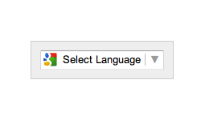
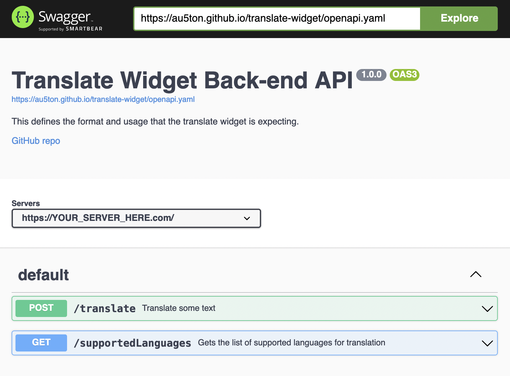

# rosetta

[](https://github.com/au5ton/rosetta/releases/latest)


An alternative to Google Translate's Website Translator widget that can work with any HTTP backend.

## Demo

Here are some example pages:

- Sample 1: [https://au5ton.github.io/rosetta/dist/sample.html](https://au5ton.github.io/rosetta/dist/sample.html)
- Sample 2: [https://au5ton.github.io/rosetta/dist/constitution.html](https://au5ton.github.io/rosetta/dist/constitution.html)

## Premise

On December 4, 2019 Google discontinued its popular [Google Translate Widget](https://translate.google.com/manager/website/). The widget can no longer be added to new sites. It is currently still available for websites that already have it installed.



Technically, their widget [stills works if you have the code for it](https://www.w3schools.com/howto/howto_google_translate.asp), but there's no telling when it will stop working. As of June 23, 2021, their embeddable snippet is still working, even though the widget was discontinued in 2019.

#### History

- Page prior to being discontinued:

  [https://web.archive.org/web/20180801033735/https://translate.google.com/manager/website/](https://web.archive.org/web/20180801033735/https://translate.google.com/manager/website/)

- Current page:

  [https://translate.google.com/intl/en/about/website/](https://translate.google.com/intl/en/about/website/)

- Announcement of temporary support during the COVID-19 pandemic:

  [https://developers.google.com/search/blog/2020/05/google-translates-website-translator](https://developers.google.com/search/blog/2020/05/google-translates-website-translator)

## Goal

The goal of this project is to revive the simple "plug and play" usage of the legacy Google Translate Widget, but to make its functionality future-proof and transferable to other translation API providers.

## Features

- Flexible branding with options `attributionImageUrl` and `logoImageUrl`
  - Built-in branding images that follow attribution guidelines

    
    <br />
    

- Easy to use interface that is very similar to the original Google Translate widget
- Can limit the number of language options available with option `preferredSupportedLanguages`
- Translates elements even if they are added to the DOM after the page loads with [MutationObserver](https://developer.mozilla.org/en-US/docs/Web/API/MutationObserver).
- Translations are cached in memory per page per session
  - This will work best if your back-end also caches translations.
- Progress indicators are shown while translations are in progress

  

- The last language you selected is saved so the next page you visit after clicking a link automatically translates ([per session per origin](https://developer.mozilla.org/en-US/docs/Web/API/Window/sessionStorage))
- Bypass translation using the CSS class `.skiptranslate` or attribute `data-rosetta-skiptranslate="true"`. Applying these to a parent, means that it applies to its children as well.
- Only the elements that are visible in the viewport are translated, detected with [IntersectionObserver](https://developer.mozilla.org/en-US/docs/Web/API/IntersectionObserver).
- Configurable "info" and "help" buttons which can display custom text, such as help text or a disclaimer.

## Limitations

### Back-end not included

The code available in this widget details the UI portion of the widget. **However, a separate API server must be implemented and maintained by those who wish to utilitze this widget.**

Translation APIs aren't free, but a sample API server is available for prototyping. **I make no guarantees that this API server will remain active. Don't rely on this API server in production.**

Sample API server:
- [https://github.com/au5ton/rosetta-demo-server](https://github.com/au5ton/rosetta-demo-server)

The schema/model that a separate API server must implement is detailed below.

### Browser support

Only ES6 (ECMAScript 2015) is supported. This is because [esbuild](https://github.com/evanw/esbuild/issues/297) support for ES5 is only partial. To see which browsers this affects, see [caniuse.com/es6](https://caniuse.com/es6). In our TypeScript codebase, we utilize [core-js](https://github.com/zloirock/core-js) and [whatwg-fetch](https://github.com/github/fetch) to polyfill newer JavaScript features to older browsers. However, not all of the other features we take advantage of are IE11 compatible. [`sessionStorage`](https://developer.mozilla.org/en-US/docs/Web/API/Window/sessionStorage) and [`MutationObserver`](https://developer.mozilla.org/en-US/docs/Web/API/MutationObserver) are IE11 compatible, but [`IntersectionObserver`](https://developer.mozilla.org/en-US/docs/Web/API/IntersectionObserver) is not. There is nothing we can do about this.

## Usage

### Front-end

For a complete list of options and what they do, see [options.ts](src/options.ts). Their default values can be seen as they are initialized in [widget.tsx](src/widget.tsx).

```html
  <!-- Whereever you want the widget to appear -->
  <div id="translate_widget_element"></div>

  <!-- ... -->

  <!-- Somewhere in your <body> -->
  <script type="text/javascript">
    function widgetTranslateElementInit() {
      au5ton.translateWidget({
        pageLanguage: 'en',
        chunkSize: 10,
        // For Microsoft Translator API
        // attributionImageUrl: 'https://cdn.jsdelivr.net/gh/au5ton/rosetta@0.5.1/dist/msft-translator.svg',
        // For Google Cloud Translation API
        attributionImageUrl: 'https://cdn.jsdelivr.net/gh/au5ton/rosetta@0.5.1/dist/google-translate.svg',
        // To include a custom logo in the banner
        // logoImageUrl: 'https://via.placeholder.com/120x20',
        preferredSupportedLanguages: ['en', 'es', 'zh', 'de', 'fr'], // or [] to include everything
        // List of CSS classes to ignore when translating
        // Example: Ignore Google Place Autocomplete popovers
        // ignoreClasses: ['pac-container', 'pac-logo'],
        endpoints: {
          supportedLanguages: 'https://rosetta-demo-server.vercel.app/api/v3/supportedLanguages',
          translate: 'https://rosetta-demo-server.vercel.app/api/v3/translate'
        }
      }, 'translate_widget_element');
    }
  </script>
  <script src="https://cdn.jsdelivr.net/gh/au5ton/rosetta@0.5.1/dist/index.js" onload="widgetTranslateElementInit()"></script>
```

### Translate attributes

In addition to visible text, rosetta can also translate attributes in tags, such as `title` on `` and so on. The list of attributes can be specified with the `includedAttributes` option. It defaults to `title`, `placeholder` and `alt`.

### Update translations in back-end

The translation UI supports updating the translations in the back-end if an optional `updateTranslation` endpoint is provided. The idea is that the back-end caches the translations, and so the website maintainer can update these translations. If this `updateTranslation` endpoint is provided, then by hovering over the translations with the `Ctrl` key pressed, you will get a button to edit a translation.
There's more information in [This issue](https://github.com/au5ton/rosetta/pull/32).

### Back-end

Your own back-end server that implements 2 endpoints with the format detailed in [openapi.yaml](openapi.yaml) using the [OpenAPI 3.0 spec](https://swagger.io/specification/).

To preview this OpenAPI 3.0 spec, open [petstore.swagger.io](https://petstore.swagger.io/#/). At the top right, enter the following URL and press "Explore":
- `https://au5ton.github.io/rosetta/openapi.yaml`

It should look like this:



